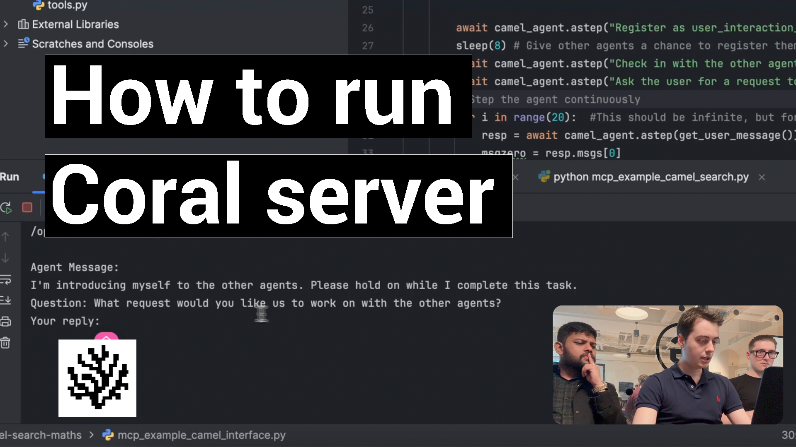

# Coral Server - Agent Fuzzy A2A (Agent to Agent) Communication MCP Tools

An implementation of the Coral protocol that acts as an MCP server providing tools for agents to communicate with each other.


## Project Description

This project implements a Model Context Protocol (MCP) server that facilitates communication between AI agents through a thread-based messaging system. 


Currently, it provides a set of tools that allow agents to:

- Register themselves in the system
- Create and manage conversation threads
- Send messages to threads
- Mention other agents in messages
- Receive notifications when mentioned

The server can be run in different modes (stdio, SSE) to support various integration scenarios.


### Status / future direction
This project is in its early stages and is not yet production-ready. The current focus is on building a robust foundation for agent communication, with plans to add more features and improve performance in the future.

Right now, this is "Local-mode" only, but we are working on a "Remote-mode" that will allow agents to communicate over the internet.

For remote mode, we will mostly preserve the interface provided by these MCP tools, but add server configuration options to allow for communicating with remote coral servers to add their agents to the society graph.

We don't want to re-invent the wheel, so we will reuse existing protocols and standards as much as possible.
Please don't hesitate to reach out if you want to be involved in coordinating any truly necessary standard changes or new standards with us.

## How to Run

### Quick example
This repo is a server that enables agents to communicate with each other, for an example of a full multi-agent system using this, check out
[the example here](/examples/camel-search-maths) or for a step-by-step guide to building agentic applications from scratch, follow this tutorial:  
  [https://github.com/Coral-Protocol/existing-agent-sessions-tutorial-private-temp](https://github.com/Coral-Protocol/existing-agent-sessions-tutorial-private-temp)

### Demo Video

[](https://youtu.be/MyokByTzY90)
*Click the image above to watch the demo video*

The project can be run in several modes:

### Using Gradle

```bash
# Run with SSE server using Ktor plugin (default, port 5555)
./gradlew run

# Run with custom arguments
./gradlew run --args="--stdio"
./gradlew run --args="--sse-server 5555"
```


### Using Docker

Install [Docker](https://docs.docker.com/desktop/)

```bash
# Build the Docker Image
docker build -t coral-server .

# Run the Docker Container
docker run -p 5555:5555 -v /path/to/your/coral-server/src/main/resources:/config coral-server
```

### Run Modes

- `--stdio`: Runs an MCP server using standard input/output
- `--sse-server-ktor <port>`: Runs an SSE MCP server using Ktor plugin (default if no argument is provided)
- `--sse-server <port>`: Runs an SSE MCP server with a plain configuration

## Available Tools

The server provides the following tools for agent communication:

### Agent Management
- `list_agents`: List all registered agents

### Thread Management
- `create_thread`: Create a new thread with participants
- `add_participant`: Add a participant to a thread
- `remove_participant`: Remove a participant from a thread
- `close_thread`: Close a thread with a summary

### Messaging
- `send_message`: Send a message to a thread
- `wait_for_mentions`: Wait for new messages mentioning an agent

## Connections (SSE Mode)

### Coral Server
You can connect to the server on:  

```bash
http://localhost:5555/devmode/exampleApplication/privkey/session1/sse
```

### MCP Inspector
You can connect to the server using the MCP Inspector command:

```bash
npx @modelcontextprotocol/inspector sse --url http://localhost:5555/devmode/exampleApplication/privkey/session1/sse
```
### Register an Agent
You can register an agent to the Coral Server (also can be registered on MCP inspector) on:

```bash
http://localhost:5555/devmode/exampleApplication/privkey/session1/sse?agentId=test_agent
```


## Philosophy

Open infrastructure for the Society of AI Agents

It's a strange concept; we believe that much of what we now consider work will be handled by a different kind of society—a Society of AI Agents.

To bridge this gap, Coral Protocol was built as the connective tissue of this society. Coral is designed to enable agents to discover one another, communicate securely, exchange value, and scale their collaborative efforts from any framework.

We theorize that not only will this fix many problems with the composability of multi-agent systems, but it will also unlock their full potential to be much more capable and safe, this is due to the graph-like structure that prevents any one agent from holding too much power or becoming overwhelmed with too much responsibility. 

## Contribution Guidelines

We welcome contributions! Email us at [hello@coralprotocol.org](mailto:hello@coralprotocol.org) or join our Discord [here](https://discord.gg/rMQc2uWXhj) to connect with the developer team. Feel free to open issues or submit pull requests.

Thanks for checking out the project, we hope you like it!

### Development
IntelliJ IDEA is recommended for development. The project uses Gradle as the build system.

To clone and import the project:
Go to File > New > Project from Version Control > Git.
enter `git@github.com:Coral-Protocol/coral-server.git`
Click Clone.

### Running from IntelliJ IDEA
You can click the play button next to the main method in the `Main.kt` file to run the server directly from IntelliJ IDEA.

